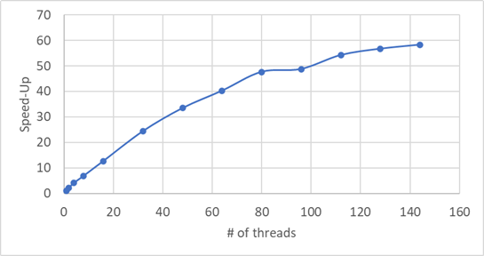

# Parallel Algorithm for Finding a Leafy Forest of an Undirected Graph

## How to run the code?

Install dependencies:
```bash
make install
```

Run tests:
```
make test
```

Run on a graph from file `<filename>`:
```
make run FILE=<filename> REPEAT=<num>
```
For example:
```
make run FILE=graph_example.txt REPEAT=6
```

## Speed Benchmark

I tested the code on a large graph, https://snap.stanford.edu/data/com-Orkut.html, which has 3072441 nodes and 117185083 edges, on Intel(R) Xeon(R) CPU E7-8867 v4 @ 2.40GHz, which has 72 cores and 144 hyper-threads. Here is the result:

